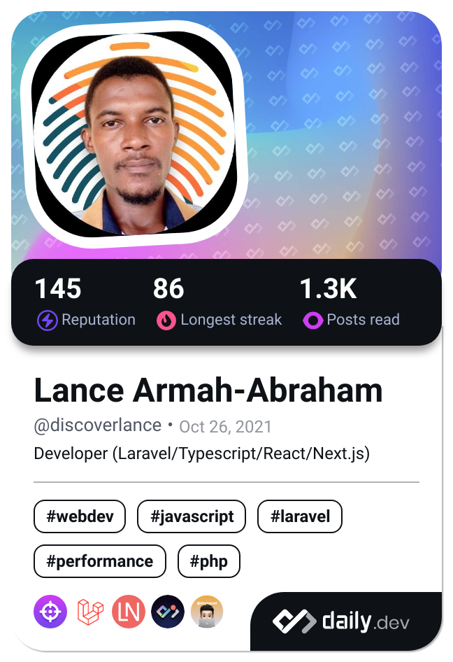

# Hi there 👋

I am Lance Armah-Abraham.

    <h3 style="color: #9F9F9F; margin: 0;">Visit website</h3>
    <a href="https://discoverlance.com" target="_blank" class="big-font" style="color: #fff; font-size: 28px; width: calc(100% - 40px); line-height: 32px;">https://discoverlance.com</a>

## 💫About Me :
  - 👯 I’m looking to collaborate on:
     - Building an open source library, I really have nothing in mind but looking forward to something to do with javascript,php or css design library with tailwind  
  - 🤝 I’m looking for help with:
      - Contributing to open source projects
      - Data Structures and Alogrithms
      - Rust
      - Time management
  - 🌱 I’m currently learning:
      - Python (I started using python to build a couple of functions and realized, boom, I really don't know much about python so taking some lessons on python)
      - Data structures and Algorithms
  - 💬 Ask me about
      - Javascript and Typescript
      - Building React projects
      - Building with Laravel
  - ⚡ Fun fact:
      - I am a huge fan of anime.

## Daily.dev
I explore daily.dev a lot for articles now. It's almost like my tech google with bookmarks and all.

 
<!--  -->

## 🌐Socials
      

<!-- 
// put some tech stack here to use later
   
-->
# 💻Tech Stack
                       

## 📊GitHub Stats :
 
 

## 🏆 Trophies

  

## ✍️Random Dev Quote

## 💰You can help me by Donating
 
  
 ---

### :zap: Recent Activity

<!--START_SECTION:activity-->
1. 🗣 Commented on [#2](https://github.com/yarlson/vite-plugin-use-golang/issues/2#issuecomment-3694192605) in [yarlson/vite-plugin-use-golang](https://github.com/yarlson/vite-plugin-use-golang)
<!--END_SECTION:activity-->

---

  <!-- Proudly created with GPRM ( https://gprm.itsvg.in ) -->

<!--
**Lance1997/lance1997** is a ✨ _special_ ✨ repository because its `README.md` (this file) appears on your GitHub profile.

Here are some ideas to get you started:

- 🔭 I’m currently working on ...
- 🌱 I’m currently learning ...
- 👯 I’m looking to collaborate on ...
- 🤔 I’m looking for help with ...
- 💬 Ask me about ...
- 📫 How to reach me: ...
- 😄 Pronouns: ...
- ⚡ Fun fact: ...
-->

